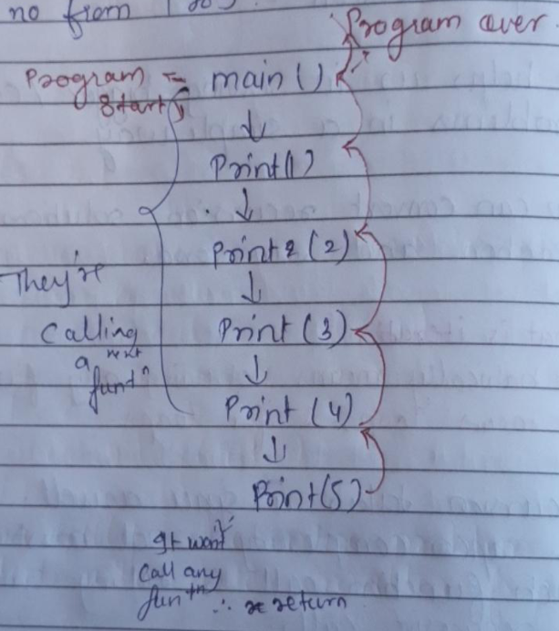
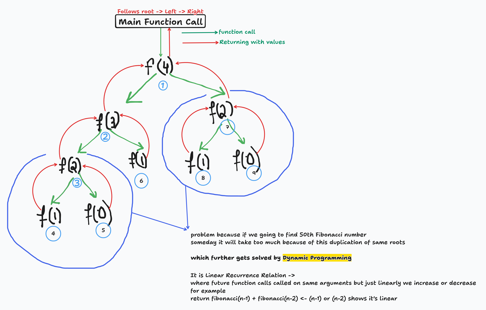

# 🔄 Recursion in Programming

## Definition

**Recursion** is a process in which a function calls itself directly or indirectly. It allows the function to repeat its
logic to solve a problem, effectively acting as a functional alternative to traditional loops.

Notes here-> https://sl1nk.com/Ihhc4
---

## Why Use Recursion?

* ⭐ **Simplifies Complexity:** It helps in solving bigger or more complex problems in a simpler, more readable way.
* ⭐ **Divide and Conquer:** It is highly effective at breaking down a large problem into smaller, manageable
  sub-problems.
* ⭐ **Interchangeability:** You can convert a recursive solution into a loop (Iteration) and vice versa.

---

## Space Complexity Analysis

While recursion and iteration can solve the same problems, they handle memory differently:

| Feature              | Iteration (Loops)              | Recursion                                        |
|:---------------------|:-------------------------------|:-------------------------------------------------|
| **Space Complexity** | $O(1)$ (Constant)              | $O(N)$ (Linear)                                  |
| **Memory Usage**     | Uses a fixed amount of memory. | Uses the **Call Stack** for each recursive call. |

### Visual Representation



> **Note:** Because every recursive call creates a new stack frame, the space complexity is $O(N)$. If the recursion is
> too deep without reaching a base case, it can lead to a **Stack Overflow** error.

---

## Key Takeaway

Recursion is a powerful tool for problems that have a repetitive structure (like Tree traversals or DFS), but it must be
used carefully due to its $O(N)$ memory overhead compared to the $O(1)$ efficiency of a standard loop.

---

## Recursion Types

### Tail Recursion

* Where recursive Function call is the last operation of the function
* and future function does not interact with any other function such as in addition or something

```java
static void print(int n) {
    if (n == 5) { // base case where function stops
        System.out.println(n);
        return;
    }
    System.out.println(n);

    //here recursive function call is not doing any +, - with future recursion calls
    // and also does not depend on them for completion
    print(n + 1);
}
```

### Non Tail Recursion

* Where recursive Function call is not last operation of the function
* future function does interact with any other function such as in addition or something

```java
static int fibonacci(int n) {
    if (n < 2) { // base case where function stops
        return n;
    }

    //here recursive function call is doing + with future recursion calls
    // and also it does depend on them for completion of function and answer
    return fibonacci(n - 1) + fibonacci(n - 2);
}
```

### Recursive Tree for Fibonacci Series



## Types of Recurrence relations in Recursion

1. **Linear Recurrence Relation**
   where future function calls called on same arguments but just linearly we increase or decrease

* **for example**  
  `fibonacci(N) = fibonacci(N-1) + fibonacci(N-2) <- (n-1) or (n-2) shows it's linear`

2. **Divide & Conquer Recurrence Relation**
   In this type of Recurrence relation we divide the array exponentially or multiply it exponentially to get our answer

`BinarySearch(N) = O(1) + BinarySearch(N/2) <- Here O(1) means it compares with target and arr[mid] is it bigger smaller or equals to it`

## How to Understand and Approach a problem using Recursion

1. Identify if you can breakdown problem into smaller problem or not
2. Form Recurrence Relation *(if needed)*
3. Draw the recursive tree.
4. About the tree.

### Points to remember

#### (Aspect 1)

1. ⭐ **See the flow of function, how they are getting in stack.**
2. ⭐ **Identify the flow oof left tree and right tree calls.**
3. ⭐ **Draw the tree and pointer again and again using pen & paper to understand it better.**
4. ⭐ *Use Debugger to see the change and stack.**
5. ⭐ **See how the values are returned at each step.**
6. ⭐ **See where two function call coming out of, In the end you come out main function.**

#### Aspect(2): (Golden Rule ⛳)

If we Know What **variables** will be there

1. **Arguments**: These will be passed to future function and future function will use them
2. **return type**: What type which the problem is demanding is it integer, String or etc...
3. **Body of function**: these are the ones which changes at each function call which does not even needs to be in
   argument you can generate them using arguments at each function call

### For Example (Binary Search Code)

```java 
static int binarySearchRecursion(int[] arr, int target, int start, int end) { // -> Int will be return type
    /**
     Start and end needs to be passed in future recursion call because that will determine which part have been search and which not
     Mid is not in the arguments because at each function call we gonna calculate the mid and check is it bigger, smaller or equals to target element or not
     */
    if (start > end) { // if we didn't found the element and start pointer is bigger to end pointer
        return -1;
    }
    int mid = start + (end - start) / 2;

    if (arr[mid] == target) {
        return mid;
    }
    if (arr[mid] < target) {
        /// return is important if you have return type such as int, String or others except void
        return binarySearchRecursion(arr, target, mid + 1, end);
    }
    return binarySearchRecursion(arr, target, start, mid - 1);
}
```